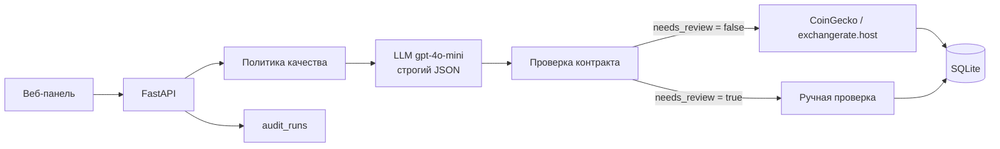

# Разведчик валют и криптоактивов

Сервис собирает котировки криптовалют (CoinGecko) и курсы фиатных валют (exchangerate.host) по запросу на естественном языке, сохраняет их в едином формате, показывает витрину данных с экспортом в JSON и CSV и фиксирует каждое действие в журнале аудита. Неоднозначные и невыполнимые запросы не исполняются автоматически: они получают `needs_review = true` и причину остановки.

## Возможности

- Наборы данных с привязкой к источнику: CoinGecko или exchangerate.host.
- Планирование сбора: текстовый запрос преобразуется в план со строгим JSON-контрактом.
- Сбор: топ монет, выбранные монеты, история цены за 1–365 дней, курсы валют на текущий момент или на дату.
- Витрина: последние 50, 100 или 500 записей, карточка записи, экспорт в JSON и CSV.
- Ответы на вопросы по сохранённым записям со ссылками на номера записей.
- Аудит: `audit_runs` (все действия) и `agent_runs` (решения планировщика и аналитика).

## Архитектура



| Компонент | Модуль | Назначение |
| --- | --- | --- |
| Веб-панель | `service/web` | Наборы данных, сбор, витрина, аудит |
| API | `service/api` | Маршруты, валидация входа, запись аудита |
| Политика качества | `service/planning/policy.py` | Разбор запроса, белый список методов и полей, решение о ручной проверке |
| Планировщик | `service/planning/planner.py` | Вызов LLM, проверка контракта `PlanContract`, объединение решений |
| Провайдеры | `service/providers` | Клиенты CoinGecko и exchangerate.host, нормализация записей |
| Аналитик | `service/analyst.py` | Ответы по записям набора с контрактом `AnswerContract` |
| Хранилище | `service/storage.py` | SQLite: `datasets`, `records`, `agent_runs`, `audit_runs` |

Решение о сборе принимает политика качества. Модель формулирует шаги плана и может только ужесточить решение. Адрес запроса и состав полей всегда берутся из белого списка, а не из ответа модели.

## Быстрый запуск (Docker)

Требования: Docker Desktop или Docker Engine с Compose v2.

```bash
git clone https://github.com/yhb12j/currency-crypto-scout.git
cd currency-crypto-scout
cp .env.example .env          # Windows PowerShell: Copy-Item .env.example .env
# заполнить OPENAI_API_KEY и EXCHANGERATE_API_KEY в .env
docker compose up --build -d
```

Веб-панель: http://127.0.0.1:8000. Документация OpenAPI: http://127.0.0.1:8000/docs.

Остановка: `docker compose down`. Остановка с удалением данных: `docker compose down -v`.

## Запуск без Docker

Python 3.11+.

```bash
python -m venv .venv
# Windows: .venv\Scripts\activate    Linux/macOS: source .venv/bin/activate
pip install -r requirements.txt
uvicorn service.api.app:app --host 127.0.0.1 --port 8000
```

## Конфигурация

| Переменная | Обязательна | По умолчанию | Назначение |
| --- | --- | --- | --- |
| `OPENAI_API_KEY` | да | — | Ключ OpenAI-совместимого API |
| `OPENAI_BASE_URL` | нет | `https://api.proxyapi.ru/openai/v1` | Адрес API модели |
| `OPENAI_MODEL` | нет | `gpt-4o-mini` | Модель |
| `LLM_TEMPERATURE` | нет | `0.2` | Температура (0–1) |
| `LLM_TIMEOUT` | нет | `45` | Тайм-аут запроса к модели, с |
| `EXCHANGERATE_API_KEY` | да | — | Ключ exchangerate.host (тариф Free: 100 запросов в месяц) |
| `COINGECKO_API_KEY` | нет | — | Ключ CoinGecko Demo |
| `HTTP_TIMEOUT` | нет | `20` | Тайм-аут запросов к источникам, с |
| `DATABASE_PATH` | нет | `data/market.db` | Путь к файлу SQLite |

Без `OPENAI_API_KEY` планирование выполняется только политикой качества, а вопросы по данным получают `needs_review = true`. Без `EXCHANGERATE_API_KEY` сбор курсов валют возвращает HTTP 500 с записью в аудит.

## API

| Метод | Путь | Назначение |
| --- | --- | --- |
| `POST` | `/datasets` | Создать набор данных: `{"name", "source"}` → `{"status": "ok", "dataset_id"}` |
| `GET` | `/datasets` | Список наборов |
| `POST` | `/ai/plan_and_collect` | План сбора (строгий JSON). Необязательно: `dataset_id`, `collect: true` |
| `POST` | `/datasets/{id}/collect` | Сбор в набор → `{"status": "ok", "records_saved"}` |
| `GET` | `/datasets/{id}/records?limit=50` | Витрина: записи с `created_at`, `limit` от 1 до 500 |
| `GET` | `/datasets/{id}/export?format=json\|csv` | Экспорт |
| `POST` | `/datasets/{id}/ask` | Вопрос по записям набора |
| `GET` | `/audit/runs?status=&action=&limit=` | Журнал `audit_runs` |
| `GET` | `/audit/summary` | Сводка по статусам |
| `GET` | `/agent_runs?needs_review=true` | Решения планировщика и аналитика |
| `GET` | `/health` | Состояние сервиса |

Коды ответов: `400` — пустое `name`, `source` или `question`; `422` — неподдерживаемый источник, некорректный `limit` или запрос на ручной проверке при сборе; `404` — набор не найден; `502`/`504` — ошибка или тайм-аут внешнего сервиса; `500` — не задан ключ источника.

Контракт ответа `POST /ai/plan_and_collect`:

```json
{
  "plan_steps": ["..."],
  "api_url": "https://api.coingecko.com/api/v3/coins/markets?vs_currency=usd&...",
  "fields_to_keep": ["rank", "name", "symbol", "price", "currency", "change_24h"],
  "confidence": "high",
  "needs_review": false,
  "reason": "",
  "hints": [],
  "source": "CoinGecko",
  "notes": [],
  "decided_by": "policy+model"
}
```

## Примеры запросов

Тела запросов лежат в `docs/requests/`. Команды одинаково работают в bash и PowerShell (в PowerShell используется `curl.exe`).

Создать набор данных:

```bash
curl.exe -X POST http://127.0.0.1:8000/datasets -H "Content-Type: application/json" --data-binary "@docs/requests/dataset_crypto.json"
```

План сбора:

```bash
curl.exe -X POST http://127.0.0.1:8000/ai/plan_and_collect -H "Content-Type: application/json" --data-binary "@docs/requests/query_crypto.json"
```

План для двусмысленного запроса (`needs_review: true`):

```bash
curl.exe -X POST http://127.0.0.1:8000/ai/plan_and_collect -H "Content-Type: application/json" --data-binary "@docs/requests/query_ambiguous.json"
```

Сбор в набор (подставить `dataset_id`):

```bash
curl.exe -X POST http://127.0.0.1:8000/datasets/DATASET_ID/collect -H "Content-Type: application/json" --data-binary "@docs/requests/query_crypto.json"
```

Витрина и экспорт:

```bash
curl.exe "http://127.0.0.1:8000/datasets/DATASET_ID/records?limit=50"
curl.exe -o dataset.csv "http://127.0.0.1:8000/datasets/DATASET_ID/export?format=csv"
```

Вопрос по данным набора:

```bash
curl.exe -X POST http://127.0.0.1:8000/datasets/DATASET_ID/ask -H "Content-Type: application/json" --data-binary "@docs/requests/question.json"
```

## Данные и аудит

| Режим | Расположение базы |
| --- | --- |
| Docker | том `market-data`, файл `/app/data/market.db` в контейнере |
| Локально | `data/market.db` |

Таблицы:

| Таблица | Поля |
| --- | --- |
| `datasets` | `id`, `created_at`, `name`, `source` |
| `records` | `id`, `created_at`, `dataset_id`, `record_json` |
| `agent_runs` | `id`, `created_at`, `query`, `plan_json`, `needs_review`, `error` |
| `audit_runs` | `id`, `created_at`, `action`, `input`, `output`, `status`, `error`, `duration_ms` |

`audit_runs.action`: `create_dataset`, `plan_and_collect`, `collect`, `list_records`, `export`, `ask`. `status`: `ok`, `needs_review`, `error`. Секреты в `input`, `output` и `error` заменяются на `***`.

Просмотр:

- веб-панель, раздел «Аудит»: сводка, «Требует проверки», журнал с фильтрами и карточкой исходных `input`/`output`;
- API: `GET /audit/runs`, `GET /agent_runs?needs_review=true`;
- консоль: `docker compose exec api python tools/inspect_db.py 20` (локально: `python tools/inspect_db.py 20`).

## Контроль качества

Вход:

- `name`, `source`: обязательны, до 200 символов; `source` — только `CoinGecko` или `exchangerate.host`;
- `query`, `question`: до 1000 символов; `limit`: от 1 до 500.

Запрос (политика качества):

- требуется объект (монеты или валюты) и минимум одно ограничение: количество, период, дата, валюта котировки или список полей;
- запрещены закрытые и приватные данные, прогнозы и инвестиционные рекомендации;
- проверяется соответствие запроса источнику набора;
- проверяются лимиты источников: до 250 монет, история до 365 дней, у exchangerate.host нет периодов, дата не в будущем и не ранее 1999-01-01;
- поля ограничены белым списком источника; к `price` всегда добавляется `currency`.

Выход модели:

- `PlanContract` и `AnswerContract` — строгие модели pydantic (`strict=True`): `plan_steps` от 1 до 5 строк, `confidence` из `high | medium | low`, `needs_review` — boolean;
- нарушение контракта, `confidence = "low"` или `needs_review = true` от модели → ручная проверка;
- ответ на вопрос по данным принимается только со ссылками на существующие записи набора.

## Ручная проверка

Условия: `confidence = "low"`, двусмысленный или невыполнимый запрос, несоответствие источнику, нарушение контракта JSON.

Результат: `needs_review = true`, причина в `agent_runs.error` и `audit_runs.error`, внешний сервис не вызывается, `records_saved = 0`, кнопка «Собрать» в панели заблокирована.

Воспроизведение:

1. Веб-панель → «Сбор» → запрос `Собери самое важное` → «Спланировать». Появится блок «Нужна ручная проверка запроса» с причиной и рекомендациями, кнопка «Собрать» заблокирована.
2. API: `curl.exe -X POST http://127.0.0.1:8000/datasets/DATASET_ID/collect -H "Content-Type: application/json" --data-binary "@docs/requests/query_ambiguous.json"` → HTTP 422, `"status": "needs_review"`.
3. Эталонные запросы № 8, 9, 10 из `tests_data/queries.jsonl`.
4. Раздел «Аудит» → «Требует проверки».

## Эталонные запросы

Файл: `tests_data/queries.jsonl`. Поле `dataset_name` определяет набор, `source` — источник набора.

| № | Запрос | `expected_needs_review` | Обоснование | Критерий успеха |
| --- | --- | --- | --- | --- |
| 1 | Собери топ-10 криптовалют по капитализации в долларах и сохрани поля: rank, name, symbol, price, change_24h | false | Объект, количество, валюта, поля | 10 записей с полями rank, name, symbol, price, currency, change_24h |
| 2 | Собери цены bitcoin, ethereum и toncoin в рублях и сохрани поля: name, price, change_24h, updated_at | false | Три монеты, валюта, поля | 3 записи в RUB |
| 3 | Собери историю цены bitcoin в долларах за последние 7 дней | false | Монета, период, валюта | 7–8 дневных записей |
| 4 | Собери 30 криптовалют по капитализации в евро и сохрани поля: name, symbol, price, market_cap, change_7d | false | Количество, валюта, поля | 30 записей в EUR |
| 5 | Собери динамику ethereum в рублях за последние 30 дней и сохрани поля: date, price, volume | false | Монета, период, поля | 30–31 запись с date, price, currency, volume |
| 6 | Собери текущие курсы доллара, евро и юаня к рублю | false | Валюты и база | 3 записи: RUB за 1 USD, EUR, CNY |
| 7 | Собери курсы доллара, евро и тенге к рублю на дату 2026-09-01 | false | Валюты, база, дата | 3 записи с датой 2026-09-01 |
| 8 | Собери самое важное | true | Нет объекта и ограничений | `needs_review: true`, сбор не выполнен |
| 9 | Собери данные по рынку и сделай вывод | true | Нет объекта, требуется вывод | `needs_review: true`, сбор не выполнен |
| 10 | Собери закрытую статистику ордеров всех бирж и прогноз курса биткоина на завтра | true | Закрытые данные и прогноз | `needs_review: true`, сбор не выполнен |

Прогон через работающий сервис (создаёт наборы и наполняет аудит):

```bash
python tools/replay_queries.py             # только планирование
python tools/replay_queries.py --collect   # планирование и сбор
```

В Docker: `docker compose exec api python tools/replay_queries.py --collect`.

## Тесты

```bash
pip install pytest
python -m pytest -q
```

В Docker: `docker compose exec api python -m pytest -q -p no:cacheprovider`. Тесты не обращаются к внешним сервисам: HTTP-вызовы и ответы модели подменяются.

## Экономический эффект

Базовая операция: получить таблицу котировок (например, топ-10 криптовалют или курсы трёх валют к рублю) и выгрузить её для работы.

| Показатель | Вручную | Сервис |
| --- | --- | --- |
| Время на операцию | 10 мин (сайт, фильтры, копирование, очистка, сведение) | 1 мин (запрос, план, сбор, экспорт) |
| 100 операций, время | 1000 мин ≈ 16,7 ч | 100 мин ≈ 1,7 ч |
| 100 операций, стоимость при ставке 600 ₽/ч | ≈ 10 000 ₽ | ≈ 1 000 ₽ труда + ≈ 20 ₽ LLM + 0 ₽ API |

Эффект: сокращение времени на 90 %, экономия около 9 000 ₽ на 100 операций, единый формат данных и полная история запусков.

## Риски и меры

| Риск | Мера |
| --- | --- |
| Модель вернула данные не по формату | Строгий контракт pydantic; нарушение → ручная проверка |
| Модель «уверенно» разрешила некорректный запрос | Решение принимает политика качества, модель может только ужесточить его |
| Подстановка произвольного адреса или полей | Адрес и поля формируются только из белого списка |
| Утечка ключей | Ключи только в `.env` (исключён из git); маскирование в журнале; ключ не попадает в `api_url` |
| Сбой или лимит внешнего сервиса | HTTP 502/504 с причиной, запись в `audit_runs`, данные не повреждаются |
| Исчерпание лимита exchangerate.host | Внешний вызов только при сборе; запросы на ручной проверке источник не вызывают |
| Ответ на вопрос без опоры на данные | Ответ принимается только со ссылками на существующие записи |

## Внедрение за 1 день

1. Получить ключи ProxyAPI и exchangerate.host, заполнить `.env`.
2. Выполнить `docker compose up --build -d` на сервере или рабочей станции.
3. Выполнить `python tools/replay_queries.py --collect` и проверить сводку аудита.
4. Создать рабочие наборы данных под задачи команды.
5. Провести короткий инструктаж пользователей: создание набора, сбор, экспорт, раздел «Аудит».

## Развитие

- Сбор по расписанию и уведомления о резких изменениях котировок.
- Графики в витрине.
- Курсы ЦБ РФ как дополнительный источник.
- PostgreSQL и разграничение доступа.
- Экспорт в Google Sheets и XLSX.

## Структура

```text
service/
  api/          маршруты FastAPI и зависимости
  planning/     разбор запроса, политика качества, планировщик, контракты
  providers/    CoinGecko, exchangerate.host
  web/          веб-панель
  analyst.py    ответы по данным набора
  audit.py      запись audit_runs
  storage.py    SQLite
tools/          прогон эталонных запросов, просмотр базы
tests/          pytest
tests_data/     эталонные запросы
docs/requests/  тела запросов для curl
```
